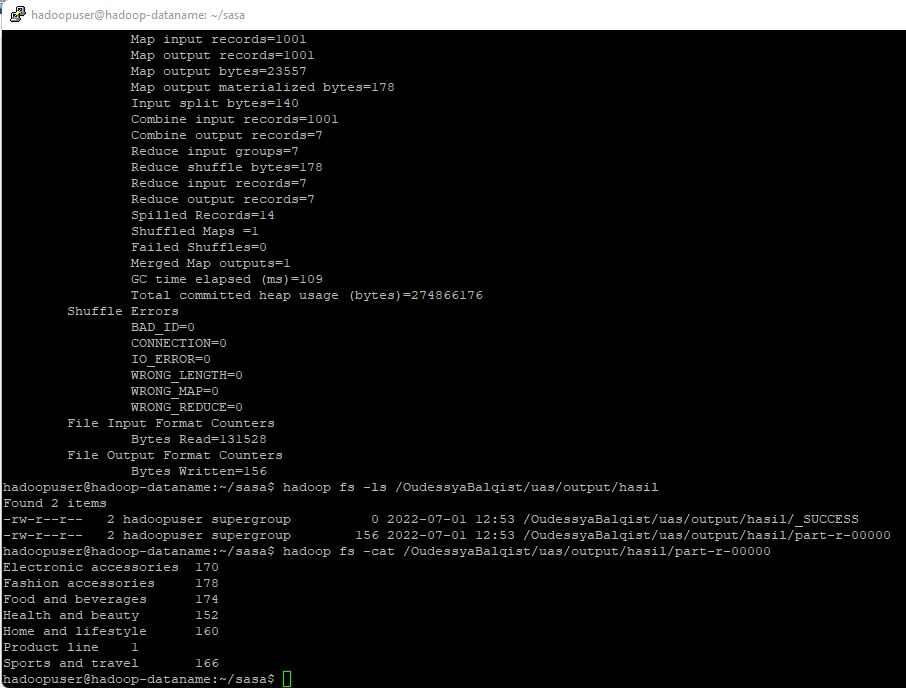

--------------------------
Oudessya Balqist Wibowo  
1941720168  
TI - 3A   
--------------------------
### Studi Kasus
Studi Kasus

Perhitungan nilai dari dataset supermarket sales yang diperoleh dari kaggle untuk mengetahui berapa banyak lini produk yang dijual. 

### Hasil Mapreduce Hadoop

### Link Demonstrasi Youtube
https://youtu.be/VBhEl__pkcI
